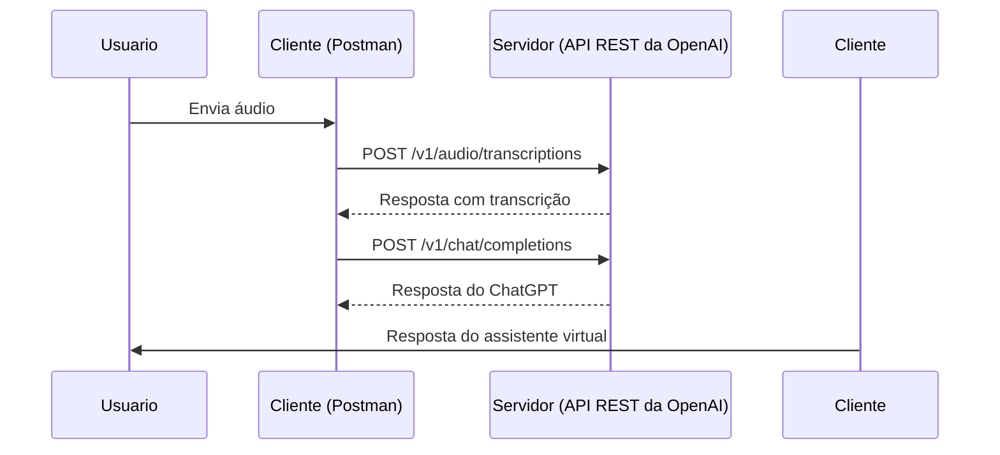

# Introdução à Web e Arquitetura Cliente-Servidor

Repositório com os fundamentos da Web e da arquitetura cliente-servidor. Você aprenderá sobre os princípios da Internet, os componentes de um sistema web, as diferentes camadas da arquitetura cliente-servidor e como elas se comunicam. Além disso, você terá a oportunidade de praticar o desenvolvimento de uma aplicação web simples.

## 1. Introdução à Web

### O que é a Web?
A Web, também conhecida como World Wide Web, é um sistema de comunicação baseado em hipertexto presente na internet. Ela permite o acesso a uma vasta quantidade de informações através de navegadores web, como o Google Chrome, Mozilla Firefox e Microsoft Edge.

### História da Web
A Web foi desenvolvida por [Tim Berners-Lee](https://pt.wikipedia.org/wiki/Tim_Berners-Lee) durante a década de 1990 para compartilhar documentos científicos. Desde então, a Web evoluiu para se tornar uma plataforma de comunicação, colaboração, comércio eletrônico e entretenimento.

### Componentes da Web
- **URL (Uniform Resource Locator)**: Endereço usado para identificar recursos na Web.
- **HTTP (Hypertext Transfer Protocol)**: Protocolo base da comunicação na Web, permitindo que clientes enviem solicitações e servidores respondam.
- **HTML (Hypertext Markup Language)**: Linguagem de marcação usada para estruturar e exibir conteúdo na Web.
- **CSS (Cascading Style Sheets)**: Linguagem de estilo usada para controlar a apresentação visual dos elementos HTML.
- **JavaScript**: Linguagem de programação usada para adicionar interatividade e dinamismo às páginas da Web.

## 2. Arquitetura Cliente-Servidor

### Conceito
A arquitetura cliente-servidor é uma forma de organizar sistemas de software onde as tarefas são distribuídas entre clientes (interface do usuário) e servidores (gerenciam recursos e serviços).

### Componentes
- **Cliente**: Interface instalada nos dispositivos dos usuários finais, como navegadores web, aplicativos móveis ou desktop.
- **Servidor**: Gerencia, armazena e fornece recursos e serviços solicitados pelos clientes.

### Comunicação
- **Protocolo HTTP**: Usado para comunicação entre clientes e servidores web.
- **Web Services e APIs**: Permitem comunicação entre plataformas diferentes usando protocolos padrão como HTTP.
- **Sockets de Rede**: Permitem comunicação direta entre clientes e servidores para aplicações em tempo real.

### Vantagens
- **Escalabilidade**
- **Centralização de recursos**
- **Segurança**
- **Facilidade de manutenção**
- **Flexibilidade**

Fonte: https://www.g2.com/articles/what-is-an-api#definition

## 3. Protocolos de Comunicação na Web

### HTTP e HTTPS
- **HTTP**: Protocolo mais utilizado na Web para comunicação entre navegador e servidor.
- **HTTPS**: Versão segura do HTTP que adiciona criptografia aos dados transmitidos.

### Métodos HTTP
- **GET**: Solicita dados.
- **POST**: Envia dados.
- **PUT**: Atualiza dados.
- **DELETE**: Remove dados.

## 4. Tendências e Boas Práticas: APIs, REST, Microsserviços

### APIs (Application Programming Interfaces)
Interfaces de programação que permitem a comunicação entre diferentes componentes de software.

#### Benefícios
- **Reutilização de código**
- **Integração**
- **Escalabilidade**

Fonte: https://www.g2.com/articles/what-is-an-api#working

### REST (Representational State Transfer)
Estilo arquitetural para sistemas distribuídos, incluindo APIs, usando HTTP.

#### Princípios
- **Cliente-Servidor**
- **Stateless**
- **Cache**
- **Interface uniforme**
- **Sistema em camadas**

### Microsserviços
Abordagem arquitetural que divide um sistema em serviços independentes e bem definidos.

#### Vantagens
- **Escalabilidade**
- **Facilidade de manutenção**
- **Desenvolvimento ágil**
- **Resistência a falhas**

#### Desafios
- **Gerenciamento de comunicação**
- **Monitoramento**
- **Consistência de dados**
- **Distribuição de carga**
- **Segurança**

## 5. Desafio Prático: Simulação de Assistente Virtual com OpenAI

### Descrição
Vamos criar um assistente virtual acionado por voz utilizando a [API REST da OpenAI](https://www.postman.com/devrel/workspace/openai). Iremos consumir dois endpoints via Postman para demonstrar como diferentes soluções podem explorar a arquitetura cliente-servidor na prática.

### Endpoints
1. **Transcrição de Áudio**: `POST https://api.openai.com/v1/audio/transcriptions`
    - Enviar um áudio gravado com a pergunta para o assistente.
2. **Chat com GPT**: `POST https://api.openai.com/v1/chat/completions`
    - Enviar a pergunta transcrita para o endpoint do ChatGPT para obter uma resposta.

### Diagrama

